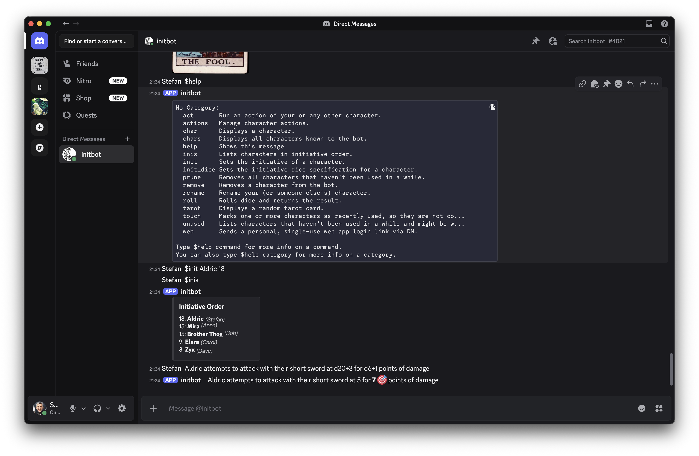
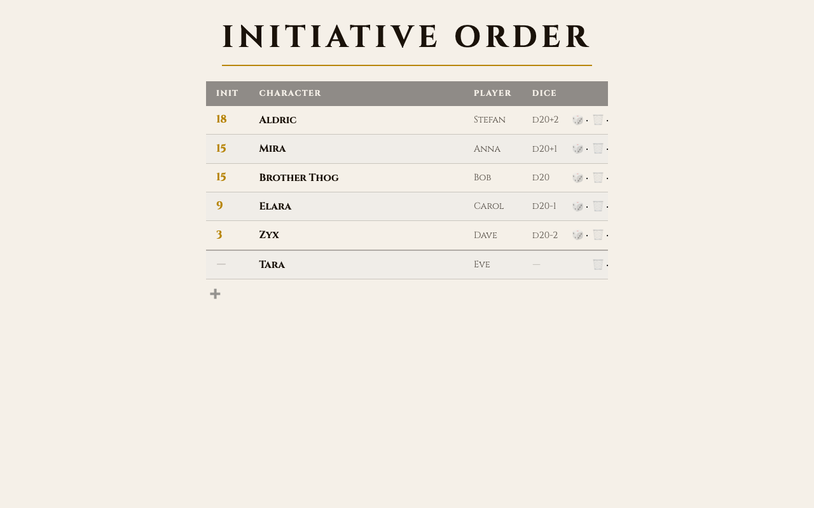

# Initbot

[](https://www.bestpractices.dev/projects/12602)

An RPG initiative tracker: a Discord chat bot and a companion web app that help with some chores during RPG sessions.





---

## For Players

### What it does

Initbot helps your group to stay on top of the initiative order during combat and a few other things. You can:

- Set your character's initiative, or have the bot roll it for you
- See all characters in initiative order, live-updated as others make changes
- Create, rename, and remove characters (including NPCs)
- Roll virtual dice

**Discord bot** — type commands in any channel the bot is in, or send it a direct message.
Type `$help` to see everything it can do.

**Web app** — view and manage the initiative order and characters on all your preferred devices without Discord.

### Adding the web app to your phone

You can add the web app to your phone's home screen so it opens like any other app — no browser bar, just the tracker.

- **Android** — open the join link in Chrome, then tap the three-dot menu → *Add to Home Screen*
- **iPhone** — open the join link in Safari, tap the Share button → *Add to Home Screen*

Tap the icon on your home screen to open it directly next time.

### Either application works on its own

You don't need both. If your group only uses Discord, the chat bot alone is fine. If your
group prefers a browser view, the web app can run without the bot. When both are running,
they share the same data automatically — a change made in one shows up in the other instantly.

### Accessing the web app

You can get into the web app in two ways:

- **Admin** — the admin (who runs initbot on some computer) shares a link with you - you open it, enter your display name, and you're in.
  (Keep that join link secret - anyone who has it can join)
- **Chat bot** — if your group uses both the chat bot and the web app, type `$web` in Discord. The bot sends you a DM with a private,
  single-use join link.

---

## For Admins

You can run the chat bot, the web app, or both — they work independently or in tandem.

| What you run | What players can use |
|---|---|
| Chat bot only | All chat bot commands |
| Web app only | Web interface (share join link with players) |
| Both together | Both interfaces work in tandem; changes sync automatically |

### Quick Start

1. Clone and configure:
   ```sh
   git clone https://github.com/stefangotz/initbot.git
   cd initbot
   ./tools/configure.sh
   ```
   The setup wizard asks you which application(s) you want to run and how.

2. Start initbot (requires Docker):
   ```sh
   ./tools/run.sh
   ```


### Sharing access with players

When the web app starts, it prints a **Join link**. Share this link with your players — anyone
who visits it can enter a display name and access the tracker. The link contains a
hard-to-guess "secret" that acts as the access key, so share it only with players you trust.

Players who use the Discord `$web` command receive their own private link via DM; no action
is needed from you beyond having both the bot and the web app running.

### Deployment modes

Deployment modes reflect which parts of initbot you want to run and how you want to run them.

Select the mode by running `configure.sh` and then start the application(s) with `./tools/run.sh`.

#### Chat bot modes

The chat bot has really only two "modes": on and off.

#### Web app modes

The deployment modes of the web app say who can access it and how it's set up.

**Off**: you decide to not run the web app at all.

**Local mode:**
- access limited to you yourself on your own system (laptop, ...) at
`http://localhost:8080`
- you run web app on your own local system

**ngrok mode:**
- players access web app from anywhere like any other web site
- you run web app on your own local system (laptop, ...)
- uses ngrok tunnel service & requires free ngrok account
- static ngrok hostname recommended
- `configure.sh` asks for you ngrok auth token

**Webserver mode:**
- players access web app from anywhere like any other web site
- you run web app on a "web server" with ports 80 and 443 exposed and some DNS host name pointing at that server
- server can be your laptop, a home server, or some remote server or cloud VM
- `configure.sh` asks for your DNS host name
- internally uses Caddy and Let's Encrypt for TLS/HTTPS

To run as a persistent background service on Linux: `./tools/set_up_systemd.sh compose` installs a
systemd unit and prompts whether to enable and start it.

### Configuration

Run `./tools/configure.sh` to update your configuration and then restart the applications. Settings are stored in
`.env` files:

| File | Used by | Typical contents |
|---|---|---|
| `.env` | both | `state=` (SQLite path) |
| `.env.chat` | chat bot | `token=`, `command_prefixes=` |
| `.env.web` | web app | `web_url_path_prefix=`, `web_port=` |

You can also pass any setting as a command-line option or environment variable;
see the config files linked in the developer section for the full list.

---

## For Developers

### Architecture

Two independent Python applications share a SQLite database file:

- **initbot-chat** (`packages/initbot-chat/`) — Discord bot built on `discord.py`. Writes
  character and initiative data to SQLite. Optionally writes single-use login tokens so the
  web app can authenticate Discord players.
- **initbot-web** (`packages/initbot-web/`) — Starlette ASGI app. Serves the tracker via
  SSE using [Datastar](https://data-star.dev/). Reads from SQLite and pushes live updates to
  browsers. Handles two login flows: standalone join (display name only) and Discord token
  (one-time link from `$web`).
- **initbot-core** (`packages/initbot-core/`) — shared data models, state abstractions, and
  the SQLite state layer used by both apps.

The two apps have no direct network communication. SQLite is the only shared state.

### Development setup

```sh
./tools/set_up_dev.sh               # uv, venv, pre-commit hooks
./tools/run_web_standalone_dev.sh   # web app with 5 sample characters
```

The dev server prints `Join link: http://localhost:8080/dev/join/` at startup.

### Web frontend

The tracker is a single Jinja2 template (`tracker.html`) driven by Datastar RC.8 SSE
signals. `AGENTS.md` documents Datastar-specific gotchas: attribute colon format, lowercase
signal names, `data-on:click` / `data-init` conflicts, and POST interception patterns.

### Containers

Two Docker images are built from the same `Dockerfile`:

| Target | Image | Entrypoint |
|---|---|---|
| `chat` | `initbot-chat` | `/app/bin/initbot` |
| `web` | `initbot-web` | `/app/bin/initbot-web` |

```sh
docker build --target chat -t initbot-chat .
docker build --target web  -t initbot-web  .
docker compose up --build  # starts services per COMPOSE_PROFILES in .env
```

### Configuration system

Parameters load from layered `.env` files (shared → app-specific) with environment variables
and CLI flags taking precedence. Supported parameters are defined in:

- [`packages/initbot-core/src/initbot_core/config.py`](packages/initbot-core/src/initbot_core/config.py)
- [`packages/initbot-chat/src/initbot_chat/config.py`](packages/initbot-chat/src/initbot_chat/config.py)
- [`packages/initbot-web/src/initbot_web/config.py`](packages/initbot-web/src/initbot_web/config.py)

### Workflow

See `AGENTS.md` for branch/PR conventions, commit workflow, CI monitoring, and the
Dependabot/uv workspace quirk where Dependabot only updates `uv.lock` but not
`pyproject.toml` for workspace members.
